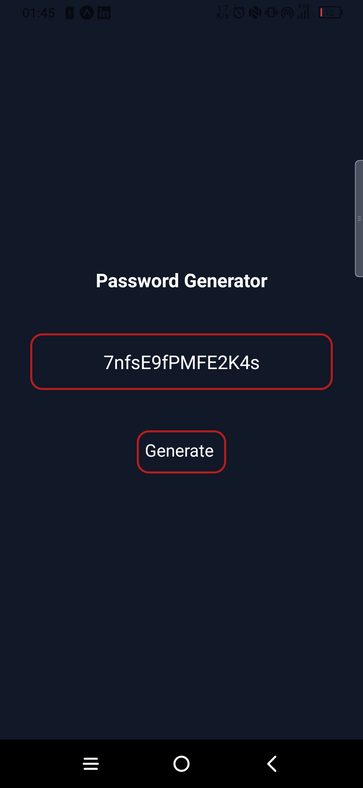

## 🔑 `Password Generator Mobile App`

<br>

- ✅ Password Generator Mobile App

<br>

<div align="center">
<h3>⚡Mobile App</h3>

</div>

<br>
<br>

Used Technologies in The Project:

[](https://reactnative.dev/)
[](https://expo.dev/)
[](https://www.nativewind.dev/)

<br>

### Installation

```bash
git clone https://github.com/furkankayam/password-generator-mobile.git
```

<br>

### Usage

```bash
npm install
```

```bash
npm run start
```

<br>

<br>

# License

This project is licensed under the MIT License. See the [LICENSE](./LICENSE) file for details
